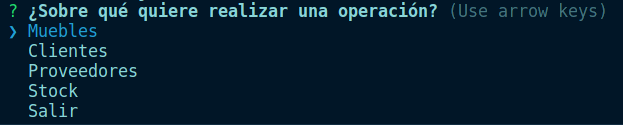

- Autores: 
  1. **Omar Suárez Doro: alu0101483474@ull.edu.es** 
  2. **Antonio Ramos Castilla: alu0101480367@ull.edu.es**
  3. **Ithaisa Morales Arbelo: alu0101482194@ull.edu.es**
- Asignatura: **Desarrollo de Sistemas Informáticos**
- Para ejecutar: **node dist/proyecto/Items/Menu/Menu.js**
  
[](https://github.com/ULL-ESIT-INF-DSI-2324/ull-esit-inf-dsi-23-24-prct07-dsikea-datamodel-groupb/actions/workflows/coveralls.yml)

# Índice
- [1. 📚 Introducción 📚](#1--introducción-)
- [2. 🧠 Trabajo previo 🧠](#2--trabajo-previo-)
- [3. 🖥️ Desarrollo de la práctica 🖥️](#3-️-desarrollo-de-la-práctica-️)
- [4. 💡 Conclusiones 💡](#4--conclusiones-)
- [5. 📘 Infografía y Webgrafía 📘](#5--infografía-y-webgrafía-)

# 1. 📚 Introducción 📚

Este informe tiene como objetivo la redacción de los pasos seguidos durante el desarrollo de la séptima practica de la asignatura **Desarrollo de Sistemas Informáticos**.

# 2. 🧠 Trabajo previo 🧠

Para la realización de esta práctica, en primer lugar se han visualizado los vídeos respecto a [Integración continua de código fuente TypeScript ejecutado en Node.js a través de una GitHub Action](https://drive.google.com/file/d/1hwtPovQlGvthaE7e7yYshC4v8rOtLSw0/view) y [configuración de workflow de GitHub Actions para enviar información de cubrimiento a Coveralls](https://drive.google.com/file/d/1hwtPovQlGvthaE7e7yYshC4v8rOtLSw0/view).

Se han realizado los siguientes resúmenes:

> [!Important]
> # GitHub Actions
> 1. Nos dirigimos a la pestaña `actions` en el repositorio de GitHub. Si nos centramos en *Continuous integration workflows*, seleccionamos [Node.js](https://nodejs.org/en).
> 
> 2. La estructura del archivo `node.js.yml` es la siguiente:
> - name: Nombre del flujo de trabajo
> - Pull y Push: Cada vez que se realice un push o un pull en la rama main, se realizarán los jobs especificados.
> - jobs: Los trabajos a realizar, un ejemplo sería el siguiente.
> ```js
> name: Tests
> on:
>   push:
>      branches: [ main ]
>   pull_request:
>      branches: [ main ]
> 
> jobs:
>  build:
>    runs-on: ubuntu-latest # Se debe correr en la última versión de ubuntu estable
>
>    strategy:
>      matrix:
>        node-version: [16.x, 18.x, 19.x, 20.x, 21.x] # Se ejecuta en todos estornos.
>        # See supported Node.js release schedule at https://nodejs.org/en/about/releases/
>
>    steps: # Pasos a arealizar
>    - uses: actions/checkout@v4
>    - name: Use Node.js ${{ matrix.node-version }}
>      uses: actions/setup-node@v4
>      with:
>        node-version: ${{ matrix.node-version }} # Configuración del entorno.
>    - run: npm install
>    - run: npm test
> ```
> 3. Realizar un commit (se habrá creado un fichero para nuestra github action).
> 4. Se puede crear un badge (opcional)
> # Integración de Coveralls en GitHub action
> 5. Desinstalamos Coveralls `npm uninstall coveralls`.
> 6. Modificación del script coverage
> ```json
> "coverage": "nyc npm test && nyc report --reporter=lcov",
> ```
> 7. Creamos en el directorio `.github/workflows` un nuevo fichero `coveralls.yml`.
>
> ```js
> name: Coveralls
> on:
>   push:
>      branches: [ main ]
>   pull:
>      branches: [ main ]
> 
> jobs:
>  build:
>
>    runs-on: ubuntu-latest
>
>    steps:
>    - name: Cloning repo
>      uses: actions/checkout@v4
>    - name: Use Node.js 21.x
>      uses: actions/setup-node@v4
>      with:
>        node-version: 21.x
>    - name: Installing dependencies
>      run: npm install
>    - name: Generating coverage information
>      run: npm run coverage
>    - name: Coveralls GitHub Action
>      uses: coverallsapp/github-action@v2.2.3
>      with:
>        github-token: ${{ secrets.GITHUB_TOKEN }}
> ```
> 
> # Integración de SonarCloud en GitHub action
> 8. Inicio de sesión en la web de [SonarCloud](https://sonarcloud.io)
> 9. Se añade el repositorio en cuestión.
> 10. Nos dirigimos a la pestaña de `Administration > Analysis Method` y desactivamos el análisis automático.
> 11. En esa misma pestaña, en el apartado `with Github Actions` hacemos click y copiamos el token.
> 12. En Github en la configuración del repositorio, concretamente en el apartado `Secrets and variables`, añadimos un nuevo secreto con la información obtenida.
> 13. En la misma página que estábamos seleccionamos la opción de JS en el siguiente paso y copiamos el contenido que se proporciona para la action.


# 3. 🖥️ Desarrollo de la práctica 🖥️

  * CLASE ABSTRACTA MUEBLE
  
    Se nos pedía disponer de distintas categorías de muebles. Todas las categorías compartían una serie de atributos en común, por ende, optamos por realizar la clase abstracta mueble. El constructor de esta clase recibe todos estos atributos *protected* y cuenta con getters y setters públicos para poder acceder desde las clases concretas a estos valores y poder modificarlos.
    
    Además, creamos el tipo personalizado `Dimension` que no es otra cosa que un conjunto de tres datos de tipo `number`. Nos sirve para representar el conjunto de medidas de un mueble.

    Destacar que la sintaxis `[key: string]: unknown;` consiste en un signature. Estas sirven por un lado para poder definir propiedades dinámicamente (aunque no las estamos usando para ello en esta práctica) y por otro lado sirven para poder indexar las propiedades usando '[]'.

    ```typescript
    export abstract class Mueble {
    protected id_: number;
    protected nombre_: string;
    protected descripcion_: string;
    protected material_: string;
    protected dimensiones_: Dimension;
    protected precio_: number;
    protected tipo_ : string = 'No definido';
    [key: string]: unknown;
    
    constructor(id: number, nombre: string, descripcion: string, material: string, dimensiones: Dimension, precio: number) {
      this.id_ = id;
      this.nombre_ = nombre;
      this.descripcion_ = descripcion;
      this.material_ = material;
      this.dimensiones_ = dimensiones;
      this.precio_ = precio;
    }
    public get id(): number {
      return this.id_;
    }
    public get nombre(): string {
      return this.nombre_;
    }
    public get descripcion(): string {
      return this.descripcion_;
    }
    public get material(): string {
      return this.material_;
    }
    public get dimensiones(): Dimension {
      return this.dimensiones_;
    }
    public get precio(): number {
      return this.precio_;
    }
    public get tipo(): string {
      return this.tipo_;
    }
    public set id(id: number) {
      this.id_ = id;
    }
    public set nombre(nombre: string) {
      this.nombre_ = nombre;
    }
    public set descripcion(descripcion: string) {
      this.descripcion_ = descripcion;
    }
    public set material(material: string) {
      this.material_ = material;
    }
    public set dimensiones(dimensiones: Dimension) {
      this.dimensiones_ = dimensiones;
    }
    public set precio(precio: number) {
      this.precio_ = precio;
    }
    public set tipo(tipo: string) {
      this.tipo_ = tipo;
    }
    }
    ```
  
  * CLASES CONCRETAS QUE EXTIENDEN DE LA CLASE MUEBLE
  
    Hemos contemplado tres categorías distintas de muebles, donde cada una difiere en los siguientes atributos:
      - Sillas: respaldo y reposabrazos
      - Mesas : cantidad de sillas que tiene y si es extensible o no
      - Armarios: si tiene cajones o no y número de puertas que tiene
    También se han implementado los getters y setters públicos de estos atributos en las correspondientes clases.

  * CLASE ABSTRACTA PERSONA
  
    Nuestro sistema gestor trabaja con información sobre los clientes y proveedores de DSIkea. Básicamente, la información que se guarda sobre ellos es la misma. Por ello se optó por crear la clase abstracta Persona que contará con los atributos comunes a los clientes y proveedores. Esta clase también tendrá los getters y setters correspondientes.

    En esta clase también contamos con un signatura para indexar las propiedades: `[key: string]: unknown;`

    Asimismo destacar que dentro del constructor de la clase utilizamos una expresión regular para asegurarnos que el contacto que see almacena de la persona tenga nueva dígitos.

    ```ts
      export abstract class Persona {
      protected contacto_: number;

      [key: string]: unknown;
      constructor(protected id_ : number, protected nombre_ : string, contacto : string, protected direccion_ : string) {
        if (!/^\d{9}$/.test(contacto)) {
          throw new Error('El contacto debe tener 9 dígitos');
        }
        this.contacto_ = parseInt(contacto);
      }
      public get id(): number {
        return this.id_;
      }
      public get nombre(): string {
        return this.nombre_;
      }
      public get contacto(): number {
        return this.contacto_;
      }
      public get direccion(): string {
        return this.direccion_;
      }
      public set id(id: number) {
        this.id_ = id;
      }
      public set nombre(nombre: string) {
        this.nombre_ = nombre;
      }
      public set contacto(contacto: number) {
        this.contacto_ = contacto;
      }
      public set direccion(direccion: string) {
        this.direccion_ = direccion;
      }
    }
    ```
  
  * CLASES CONCRETAS QUE EXTIENDEN DE PERSONA
  
    Las clases que extienden de la clase abstracta persona son **Cliente** y **Proveedor**.

  * CLASE ABSTRACTA TRANSACCIÓN
  
    Una transacción se caracteriza por tener un id, una fecha, un importe, estar asociada a un mueble y a una persona. Es por ello, que tanto una *Venta* como una *Devolución*, serán objetos de las clases concretas que extienden de la clase abstracta **Transacción**. Dicha clase cuenta con un constructor que recibe dichos atributos protegidos y tiene los getters y setters públicos correspondientes. 

    También cuenta con una signature como las clases anteriores.

    ```ts
      export abstract class Transaccion {
      protected id_: number;
      protected fecha_: Date;
      protected importe_: number;
      protected mueble_ : number;
      protected persona_ : string;
      [key: string]: unknown;
      constructor(id : number, fecha: Date, importe: number, id_mueble: number, dni_persona: string) {
        this.id_ = id;
        this.fecha_ = fecha;
        this.importe_ = importe;
        this.mueble_ = id_mueble;
        this.persona_ = dni_persona;
      }
      public get id(): number {
        return this.id_;
      }
      public get fecha(): Date {
        return this.fecha_;
      }
      public get importe(): number {
        return this.importe_;
      }
      public get mueble(): number {
        return this.mueble_;
      }
      public get persona(): string {
        return this.persona_;
      }
      public set fecha(fecha: Date) {
        this.fecha_ = fecha;
      }
      public set importe(importe: number) {
        this.importe_ = importe;
      }
      public set mueble(mueble: number) {
        this.mueble_ = mueble;
      }
      public set persona(persona: string) {
        this.persona_ = persona;
      }
      public set id(id: number) {
        this.id_ = id;
      }
    }
    ```

  * CLASES CONCRETAS QUE EXTIENDEN DE TRANSACCIÓN
  
    Las clases que extienden de la clase abstracta transacción son **Venta** y **Devolución**.

  
  * BASE DE DATOS

    Dentro del directorio `Database` tenemos organizado en los distintos ficheros con extensión *.json* los datos con los que trabaja nuestro sistema gestor. Contamos con un *cliente.json* con un total de 10 clientes iniciales, un *proveedores.json* con 10 proveedores iniciales, un *transacciones.json* con 17 ventas actuales y 9 devoluciones y por último, un *muebles.json* con 22 muebles de las distintas categorías implementadas. 

    Usando el módulo `inquirer.js`, utilizamos una interfaz por línea de comandos. Esta interfaz se encuentra en el archivo `Menu.ts`. El menú principal es el siguiente:

    

    Este es el resultado de la llamada a main(), cuyo código se corresponde con lo siguiente:

    ```ts
      async function main() {
      const answer = await inquirer.prompt({
        type: "list",
        name: "option",
        message: "¿Sobre qué quiere realizar una operación?",
        choices: ["Muebles", "Clientes", "Proveedores", "Stock", "Salir"],
      });
      switch (answer.option) {
        case "Muebles":
          menuMuebles();
          break;
        case "Clientes":
          menuClientes();
          break;
        case "Proveedores":
          menuProveedores();
          break;
        case "Stock":
          menuStock();
          break;
        case "Salir":
          console.log("Saliendo del menú...");
          process.exit(0);
        default:
          console.log("Opción no válida. Por favor, selecciona una opción válida.");
      }
    }
    ```
    
    La función `prompt` que se utiliza para recoger la información que introduce el usuario consiste en una "promesa" y es por ello que se usa `await` para esperar hasta que se cumpla. El valor que seleccione el usuario se guarda en la variable answer. Luego usando un switch, en cada caso, llamamos a las funciones necesarias.

    Todo nuestro sistema gestor se conforma mediante llamadas encadenadas a distintas funciones "menú", siendo el esquema general el siguiente:

    main() {
      * menuMuebles()
      * menuClientes()
      * menuProveedores()
      * menuStock()
    }

    menuMuebles() {
      * listarMuebles -> buscarMuebles() 
      * añadirMuebles -> menuTipoMuebleAñadir()
      * eliminarMuebles -> deleteMueble() -> buscarMueble()
      * editarMuebles -> editarMueble() -> buscarMueble()
      * buscarMuebles ->menuBusquedaMuebles()
    }

    menuTipoMuebleAñadir() {
      * sillas -> adicionarMueble()
      * mesas -> adicionarMueble()
      * armarios -> adicionarMueble()
    }

    menuBusquedaMueble() {
      * por nombre -> buscarMueble()
      * por tipo -> menuTipoMuebleBuscar()
      * por descripción -> buscarMueble()
    }

    menuTipoMuebleBuscar() {
      * sillas 
      * mesas
      * armarios
    }

    menuClientes() {
      * listarClientes -> getClientes()
      * añadirClientes -> adicionarClientes()
      * eliminarClientes -> deleteCliente()
      * editarClientes -> editarCliente()
      * buscarClientes -> menuBusquedaClientesYProveedores()
    }

    menuBusquedaClientesYProveedores() {
      * Por nombre y apellido -> getClientes() y getProveedores()
      * Por número de contacto -> getClientes() y getProveedores()
      * Por dirección -> getClientes() y getProveedores()
    }
   
    menuProveedores() {
      * listar proveedores -> getProveedores()
      * añadir proveedores -> adicionarProveedor()
      * eliminar proveedores -> deleteProveedor()
      * editar proveedores ->editarProveedor()
      * buscar Proveedores -> menuBusquedaClientesYProveedores()
    }
   
    menuStock() {
      * listar unidades disponibles -> displayStock()
      * transacciones -> menuTransacciones()
      * generar informes -> generarInformes()
    }

    menuTransacciones() {
      * ventas -> menuVentasTransacciones()
      * devoluciones -> menuDevolucionesTransacciones()
    }

    menuVentasTransacciones() {
      * añadir -> agregarVenta()
      * borrar -> eliminarVenta()
    }

    menuDevolucionesTransacciones() {
      * añadir -> agregarDevolucion()
      * borrar -> eliminarDevolucion()
    }

    generarInformes() {
      * stock de una categoría de muebles -> getStockParaInforme()
      * stock de un mueble concreto -> getStockParaInforme()
      * stock de los 5 muebles más vendidos -> getMueblesMásVendidos()
      * información sobre clientes -> getInfoCliente()
      * información sobre proveedores -> getInfoProveedor()
      * histórico de ventas -> (anual/mensual+anual/anual+mensual+diario) -> getCalendarioVentas()
    }

    
  * INTERFACES
  
    Dentro del fichero `interfaces.ts` podemos observar las tres interfaces que hemos implementado en esta práctica.

    La primera es SortStrategy. Se utiliza el patrón de diseño de estrategia para poder ordenar los resultados producidos por funciones como `buscarMueble()` por id, por orden alfabético y por precio.
    
    ```ts
    export interface sortStrategy<T> {
      sort() : (a: T, b : T) => number;
    }
    ```

    Así pues, dicha interfaz es implementada por las clases `OrdenarporId.ts`, `OrdenarPorPrecio.ts` y `OrdenarAlfabeticamente.ts`.
    
    ```ts
    export class OrdenarPorPrecio implements sortStrategy<Mueble> {
      sort() : (a: Mueble, b: Mueble) => number {
        return (a: Mueble, b: Mueble) => {
          if (a.precio < b.precio) {
            return -1;
          }
          if (a.precio > b.precio) {
            return 1;
          }
          return 0;
        }
      }
    }
    ```
    
    ```ts
    export class OrdenarAlfabeticamente implements sortStrategy<Mueble> {
      sort(): (a: Mueble, b: Mueble) => number {
        return (a: Mueble, b: Mueble) => {
          if (a.nombre < b.nombre) {
            return -1;
          }
          if (a.nombre > b.nombre) {
            return 1;
          }
          return 0;
        }
      }
    }
    ```

    ```ts
    export class OrdenarPorId implements sortStrategy<Mueble> {
      sort(): (a: Mueble, b: Mueble) => number {
        return (a: Mueble, b: Mueble) => {
          if (a.id < b.id) {
            return 1;
          }
        if (a.id > b.id) {
          return -1;
        }
        return 0;
        }
      }
    }
    ```

    Para poder implementar este patrón se implementa la función returnStrat a la que se le pasa el tipo de estrategia de Ordenación que se va a utilizar (este es un tipo personalizado).

    ```ts
    export function returnStrat(p: estrategiaOrdenacion): sortStrategy<Mueble> {
      let strat: sortStrategy<Mueble>;
      switch (p) {
        case estrategiaOrdenacion.ALFABETICAMENTE:
        strat = new OrdenarAlfabeticamente();
        break;
      case estrategiaOrdenacion.PRECIO:
        strat = new OrdenarPorPrecio();
        break;
      case estrategiaOrdenacion.ID:
        strat = new OrdenarPorId();
        break;
      default:
        strat = new OrdenarAlfabeticamente();
        break;
     }
     return strat;
   }
   ```

   ```ts
   export enum estrategiaOrdenacion {
     ALFABETICAMENTE,
     PRECIO,
     ID
   }
   ```

  * BASE DE DATOS OBSERVABLE
  
    Dado que la base de datos va a ser susceptible a cambios, se le ha implementado la interfaz Observable. De esta forma, cada vez que se cambie algo, se le va a informar a sus suscriptores, que en este caso no es otro que el gestor(stock).

    Las interfaces Observer y Observable son las siguientes:

    ```ts
    export interface Observer {
      updateStock(): void;
    }
    ```
    
    ```ts
    export interface Observable {
      subscribe(observer: Observer): void;
      unsubscribe(observer: Observer): void;
      notify(): void;
    }
    ```

    Los atributos privados de la clase Base de datos son los siguientes:

    ```ts
      private muebles_: Map<string, Map<string, Mueble[]>> = new Map<string, Map<string, Mueble[]>>();
      private clientes_: Cliente[] = [];
      private proveedores_: Proveedor[] = [];
      private ventas_: Venta[] = [];
      private devoluciones_: Devolucion[] = [];
    ```

    Donde se guardan las listas de los objetos de cada clase.

    ```ts
      private db_muebles_: LowSync<FormatoMueble> = JSONFileSyncPreset<FormatoMueble>('./Database/muebles.json', { sillas: [], mesas: [], armarios: []});
      private db_clientes_: LowSync<FormatoCliente> = JSONFileSyncPreset<FormatoCliente>('./Database/Personas/clientes.json', { clientes: [] });
      private db_proveedores_: LowSync<FormatoProveedor> = JSONFileSyncPreset<FormatoProveedor>('./Database/Personas/proveedores.json', { proveedores: [] });
      private db_transacciones_: LowSync<FormatoTransaccion> = JSONFileSyncPreset<FormatoTransaccion>('./Database/Transacciones/transacciones.json', { ventas: [], devoluciones: [] });
      private observer : Observer | null = null;
    ```

    Donde se inicializan las variables según los valores que aparecen en los ficheros de extensión json. Los datos de los tipos que almacenan estań definidos en el fichero `Types.ts`.
    
    ```ts
    export type FormatoMueble = {
      [key: string]: Mueble[];
      sillas: Mueble[];
      mesas: Mueble[];
      armarios: Mueble[];
    }
    export type FormatoCliente = {
      clientes: Cliente[];
    }
    export type FormatoProveedor = {
      proveedores: Proveedor[];
    }
    export type FormatoTransaccion = {
      ventas: Venta[];
      devoluciones: Devolucion[];
    }
    ```

    Es en el constructor de la base de datos es donde se cogen los muebles de la base de datos y se inicializan los valores de los distintos atributos. Asimismo, en la última línea suscribimos el gestor a la base de datos
    
    ```ts
      constructor(gestor: Observer) {
        for (const key in this.db_muebles_.data) {
          let tempMap: Map<string, Mueble[]> | undefined = this.muebles_.get(key);
          if (!this.muebles_.has(key)) {
            this.muebles_.set(key, new Map<string, Mueble[]>());
            tempMap = this.muebles_.get(key);
          }
          this.db_muebles_.data[key].forEach((mueble: Mueble) => {
            if (!tempMap?.has(mueble.nombre)) {
              tempMap?.set(mueble.nombre, []);
            }
            tempMap?.get(mueble.nombre)?.push(mueble);
          });
        }
        this.db_clientes_.data.clientes.forEach((cliente: Cliente) => {
          let clienteTemporal: Cliente = new Cliente(cliente.id, cliente.nombre, cliente.contacto.toString(), cliente.direccion);
          this.clientes_.push(clienteTemporal);
        });
        this.db_proveedores_.data.proveedores.forEach((proovedor: Proveedor) => {
          let clienteTemporal: Proveedor = new Proveedor(proovedor.id, proovedor.nombre, proovedor.contacto.toString(), proovedor.direccion);
          this.proveedores_.push(clienteTemporal);
        });
        this.db_transacciones_.data.ventas.forEach((venta: Venta) => {
          let ventaTemporal: Venta = new Venta(venta.id, venta.fecha, venta.importe, venta.mueble, venta.persona);
          this.ventas_.push(ventaTemporal);
        });
        this.db_transacciones_.data.devoluciones.forEach((devolucion: Devolucion) => {
          let devolucionTemporal: Devolucion = new Devolucion(devolucion.id, devolucion.fecha, devolucion.importe, devolucion.mueble, devolucion.persona);
          this.devoluciones_.push(devolucionTemporal);
        });
        this.subscribe(gestor);
      }
    ```

    A continuación, explicaremos todas las funciones que tiene la Base de Datos.

    1. BuscarMueble() -> Esta función recibe un objeto(cuyos parámetos son todos opcionales) y una estrategia de ordenación. Recorre la lista de los muebles y retorna aquellos que coincidan con el patrón de búsqueda (o todos en el caso de no introducir ningún patrón). Es por esto último por lo que esta función también se utiliza para listar todos los muebles. Asimismo podemos elegir si queremos que la salida se muestre en forma ascendente o descendente.

    ```ts
      buscarMueble(
        searchObj: {
          nombre?: string,
          tipo?: string,
          descripcion?: string,
          ordenDesc?: boolean,
          id?: number
        }, s_strat: sortStrategy<Mueble>): Mueble[] {
        let auxVec: Mueble[] = [];
        for (const m of this.muebles_.values()) {
          for (const mueble of m.values()) {
            auxVec.push(...mueble.filter((mueble) => {
              if (!searchObj.nombre && !searchObj.descripcion && !searchObj.tipo && !searchObj.id) return true;
              return searchObj.nombre && mueble.nombre.includes(searchObj.nombre) ||
                searchObj.descripcion && mueble.descripcion.includes(searchObj.descripcion) ||
                searchObj.tipo && mueble.tipo === searchObj.tipo ||
                searchObj.id && mueble.id === searchObj.id;
            }));
          }
        }
        auxVec.sort(s_strat.sort());
        return searchObj.ordenDesc ? auxVec : auxVec.reverse();
      }
    ```

    2. AdicionarMueble() -> para añadir un mueble al sistema tenemos que pasarle un objeto de tipo mueble y la categoría a la que pertenece dicho mueble (dicha categoría es un enum). Si el id del mueble que se le ha pasado ya existe en la base de datos (la longitud del resultado de buscarMueble() es distinto de 0) se lanza un error. En caso contrario, almacenamos en la variable `db` cómo está la base de datos de los muebles en ese momento. En la variable `objectToPush` almacenamos las propiedades del tipo mueble que queremos insertar. Por último escribimos el mueble en la base de datos. Después de realizar el cambio se notifica con la función `notify()` a los suscriptores (stock).

    ```ts
    adicionarMueble(mueble: Mueble, categoria: Categoria): void {
      if (this.buscarMueble({ id: mueble.id }, new OrdenarPorId()).length !== 0) {
        throw new Error('ID repetido');
      }
      const db = this.db_muebles_;
      let objectToPush: any = {};
      if (db) {
        for (const prop in mueble) {
          objectToPush[prop.slice(0, prop.length - 1)] = mueble[prop];
        }
      }
      this.insertarMuebleCategoria(categoria, mueble);
      db.data[categoria].push(objectToPush as Mueble);
      db.write();
      this.notify();
    }
    ```

    3. EditarMueble() -> Para editar un mueble se le pide el id único del mueble a modificar y los atributos que se quieren cambiar. Se pueden especificar tantos atributos como se quiera. Se itera sobre los muebles que existen y se modifican aquellas propiedades que se han especificado anteriormente. Después de realizar el cambio se notifica con la función `notify()` a los suscriptores (stock).


    ```ts
        editarMueble(id: number, modifyObject: {
        nombre?: string,
        descripcion?: string,
        precio?: number,
        material?: string,
        dimensiones?: {
          alto: number,
          ancho: number,
          largo: number
        },
      }): void {
        if (this.buscarMueble({ id: id }, new OrdenarPorId()).length === 0) {
          throw new Error('ID no encontrado');
        }
        for (let mueble in this.muebles_) {
          for (let nombre in this.muebles_.get(mueble)) {
            for (let element of this.muebles_.get(mueble)!.get(nombre)!) {
              if (element.id !== id) { continue; }
              if (modifyObject.nombre) { element.nombre = modifyObject.nombre; }
              if (modifyObject.descripcion) { element.descripcion = modifyObject.descripcion; }
              if (modifyObject.precio) { element.precio = modifyObject.precio; }
              if (modifyObject.material) { element.material = modifyObject.material; }
              if (modifyObject.dimensiones) { element.dimensiones = modifyObject.dimensiones; }
            } 
          }
        }
        for (let mueble in this.db_muebles_.data) {
          for (let i = 0; i < this.db_muebles_.data[mueble].length; i++) {
            if (this.db_muebles_.data[mueble][i].id === id) {
              if (modifyObject.nombre) { this.db_muebles_.data[mueble][i].nombre = modifyObject.nombre! }
              if (modifyObject.descripcion) { this.db_muebles_.data[mueble][i].descripcion = modifyObject.descripcion!; }
              if (modifyObject.precio) { this.db_muebles_.data[mueble][i].precio = modifyObject.precio!; }
              if (modifyObject.material) { this.db_muebles_.data[mueble][i].material = modifyObject.material!;}
              if (modifyObject.dimensiones) { this.db_muebles_.data[mueble][i].dimensiones = modifyObject.dimensiones!; }
              this.db_muebles_.write();
              return;
            }
          }
        }    
        this.notify();
      }
    ```

    4. DeleteMueble() -> A la función se le pasa el identificador único del mueble que se quiere eliminar. Si no se encuentra(la longitud de buscarMueble es igual a 0) lanza un error. Filtra los muebles para eliminar el que coincide con el id en muebles_. Luego también lo elimina de db_muebles_ utilizando splice. Después de realizar el cambio se notifica con la función `notify()` a los suscriptores (stock).
    
    ```ts
      deleteMueble(id_p: number): void {
      if (this.buscarMueble({ id: id_p }, new OrdenarPorId()).length === 0) {
        throw new Error('ID no encontrado');
      }
      for (let mueble in this.muebles_) {
        for (let m in this.muebles_.get(mueble)) {
          this.muebles_.get(mueble)!.get(m)!.filter((mueble: Mueble) => mueble.id !== id_p);
        }
      }
      const db = this.db_muebles_;
      for (let mueble in db.data) {
        for (let i = 0; i < db.data[mueble].length; i++) {
          if (db.data[mueble][i].id === id_p) {
            db.data[mueble].splice(i, 1);
            db.write();
            return;
          }
        }
      }
      this.notify();
    }
    ```

    5. AdicionarCliente() -> Le pasamos un objeto de tipo cliente. Si el id ya existe, advertimos de que el usuario ya está en la base de datos, de lo contrario, lo escribimos tanto en clientes_ como en db_clientes.

    ```ts
        adicionarCliente(cliente: Cliente): void {
        if (this.db_clientes_.data.clientes.find((c) => c.id === cliente.id)) {
          throw new Error('ID repetido');
        }
        let objectToPush: any = {};
        for (const prop in cliente) {
          objectToPush[prop.slice(0, prop.length - 1)] = cliente[prop];
        }
        this.clientes_.push(cliente);
        this.db_clientes_.data.clientes.push(objectToPush as Cliente);
        this.db_clientes_.write();
      }
    ```

    6. EditarCliente() -> La función recibe el identificador del cliente que se quiere editar y aquella serie de atributos opcionales que se quieren modificar. Sii no se encuentra el cliente, lanzamos el error porque no podemos modificar un cliente que no existe. En caso contrario, modificamos los atributos y los escribimos en la base de datos db_clientes_ y clientes_.

    ```ts
      editarCliente(id: number, modifyObject: {
      nombre?: string,
      contacto?: string,
      direccion?: string
    }): void {
      if (!this.db_clientes_.data.clientes.find((c) => c.id === id)) {
        throw new Error('ID no encontrado');
      }
      for (let i = 0; i < this.clientes_.length; i++) {
        if (this.clientes_[i].id === id) {
          if (modifyObject.nombre) { this.clientes_[i].nombre = modifyObject.nombre; }
          if (modifyObject.contacto) { this.clientes_[i].contacto = +modifyObject.contacto; }
          if (modifyObject.direccion) { this.clientes_[i].direccion = modifyObject.direccion; }
        }
      }
      for (let i = 0; i < this.db_clientes_.data.clientes.length; i++) {
        if (this.db_clientes_.data.clientes[i].id === id) {
          if (modifyObject.nombre) { this.db_clientes_.data.clientes[i].nombre = modifyObject.nombre; }
          if (modifyObject.contacto) { this.db_clientes_.data.clientes[i].contacto = +modifyObject.contacto; }
          if (modifyObject.direccion) { this.db_clientes_.data.clientes[i].direccion = modifyObject.direccion; }
        }
      }
      this.db_clientes_.write();
    }
    ```

    7. DeleteCliente() -> Se le pasa a la función el id del cliente que se quiere eliminar, si no se encuentra el cliente se lanza un error. Actualizamos this.clientes_ a la lista de todos los clientes menos el que queremos eliminar. Luego lo eliminamos de la base de datos y escribimos.
    
    ```ts
      deleteCliente(id: number): void {
      if (!this.db_clientes_.data.clientes.find((c) => c.id === id)) {
        throw new Error('ID no encontrado');
      }
      this.clientes_ = this.clientes_.filter((c) => c.id !== id);
      this.db_clientes_.data.clientes = this.db_clientes_.data.clientes.filter((c) => c.id !== id);
      this.db_clientes_.write();
    }
    ```

    8. AdicionarProveedor() -> Antes de añadir el proveedor que se le pasa como argumento, revisa que no exista ya en la base de datos, en dicho caso lanza un error. En caso contrario crea un objeto donde guarda las propiedades del proveedor e inserta dicho objeto en proveedores_ y db_proveedores_.
    
    ```ts
      adicionarProveedor(proveedor: Proveedor): void {
      if (this.db_proveedores_.data.proveedores.find((c) => c.id === proveedor.id)) {
        throw new Error('ID repetido');
      }
      let objectToPush: any = {};
      for (const prop in proveedor) {
        objectToPush[prop.slice(0, prop.length - 1)] = proveedor[prop];
      }
      this.proveedores_.push(proveedor);
      this.db_proveedores_.data.proveedores.push(objectToPush as Proveedor);
      this.db_proveedores_.write();
    }
    ```

    9. EditarProveedor() -> Se le pasa a la función el identificador del proveedor que se quiere editar y aquellos atributos que se quieren cambiar. Si no se encuentra el usuario lanza un error, si se encuentra se cambian los atributos que hayan sido seleccionados de proveedores_ y de db_proveedores_.

    ```ts
      editarProveedor(id: number, modifyObject: {
      nombre?: string,
      contacto?: string,
      direccion?: string
    }): void {
      if (!this.db_proveedores_.data.proveedores.find((c) => c.id === id)) {
        throw new Error('ID no encontrado');
      }
      for (let i = 0; i < this.proveedores_.length; i++) {
        if (this.proveedores_[i].id === id) {
          if (modifyObject.nombre) { this.proveedores_[i].nombre = modifyObject.nombre; }
          if (modifyObject.contacto) { this.proveedores_[i].contacto = +modifyObject.contacto; }
          if (modifyObject.direccion) { this.proveedores_[i].direccion = modifyObject.direccion; }
        }
      }
      for (let i = 0; i < this.db_proveedores_.data.proveedores.length; i++) {
        if (this.db_proveedores_.data.proveedores[i].id === id) {
          if (modifyObject.nombre) { this.db_proveedores_.data.proveedores[i].nombre = modifyObject.nombre; }
          if (modifyObject.contacto) { this.db_proveedores_.data.proveedores[i].contacto = +modifyObject.contacto; }
          if (modifyObject.direccion) { this.db_proveedores_.data.proveedores[i].direccion = modifyObject.direccion; }
        }
      }
      this.db_proveedores_.write();
    }
    ```

    10. DeleteProveedor() -> Para eliminar un proveedor basta con pasarle a la función el id del proveedor, se filtrará para crear una lista con todos los proveedores excepto aquel que se quiere eliminar y se sobreescribiran las variables proveedores_ y db_proveedores_.

    ```ts
        deleteProveedor(id: number): void {
        if (!this.db_proveedores_.data.proveedores.find((c) => c.id === id)) {
          throw new Error('ID no encontrado');
        }
        this.proveedores_ = this.proveedores_.filter((c) => c.id !== id);
        this.db_proveedores_.data.proveedores = this.db_proveedores_.data.proveedores.filter((c) => c.id !== id);
        this.db_proveedores_.write();
      }
    ```

    11. AdicionarVenta() -> Para añadir una venta le pasamos a la función un objeto de tipo Venta. Creamos un objeto vacío que rellenamos con las propiedades del objeto venta que le hemos pasado. Añadimos dicha venta a ventas_ y a db_transacciones_.data.ventas
    
    ```ts
      adicionarVenta(venta: Venta): void {
      let objectToPush: any = {};
      for (const prop in venta) {
        objectToPush[prop.slice(0, prop.length - 1)] = venta[prop];
        if (prop === 'fecha_') {
          objectToPush[prop.slice(0, prop.length - 1)] = venta[prop].toLocaleDateString();
        }
      }
      this.ventas_.push(venta);
      this.db_transacciones_.data.ventas.push(objectToPush as Venta);
      this.db_transacciones_.write();
    }
    ```

    12. DeleteVenta() -> Para eliminar una venta le pasamos a la función el id de la venta que queremos eliminar. Si no se encuentra lanza un error, en caso contrario, filtra y obtiene una lista de todas las ventas excepto la que se quiere eliminar y se escribe dicha lista en ventas_ y en db_transacciones_.data.ventas.

    ```ts
      deleteVenta(id: number): void {
      if (!this.db_transacciones_.data.ventas.find((c) => c.id === id)) {
        throw new Error('ID no encontrado');
      }
      this.ventas_ = this.ventas_.filter((c) => c.id !== id);
      this.db_transacciones_.data.ventas = this.db_transacciones_.data.ventas.filter((c) => c.id !== id);
      this.db_transacciones_.write();
    }
    ```

    13. AdicionarDevolucion() -> Para añadir una devolución le pasamos a la función un objeto de tipo Devolución. Creamos un objeto vacío que rellenamos con las propiedades del objeto devolución que le hemos pasado. Añadimos dicha devolución a devoluciones_ y a db_transacciones_.data.devoluciones

    ```ts
      adicionarDevolucion(devolucion: Devolucion): void {
      let objectToPush: any = {};
      for (const prop in devolucion) {
        objectToPush[prop.slice(0, prop.length - 1)] = devolucion[prop];
        if (prop === 'fecha_') {
          objectToPush[prop.slice(0, prop.length - 1)] = devolucion[prop].toLocaleDateString();
        }
      }
      this.devoluciones_.push(devolucion);
      this.db_transacciones_.data.devoluciones.push(objectToPush as Devolucion);
    }
    ```

    14. DeleteDevolucion() -> Para eliminar una devolución le pasamos a la función el id de la devolución que queremos eliminar. Si no se encuentra lanza un error, en caso contrario, filtra y obtiene una lista de todas las devoluciones excepto la que se quiere eliminar y se escribe dicha lista en devoluciones_ y en db_transacciones_.data.devoluciones.

    ```ts
      deleteDevolucion(id: number): void {
      if (!this.db_transacciones_.data.devoluciones.find((c) => c.id === id)) {
        throw new Error('ID no encontrado');
      }
      this.devoluciones_ = this.devoluciones_.filter((c) => c.id !== id);
      this.db_transacciones_.data.devoluciones = this.db_transacciones_.data.devoluciones.filter((c) => c.id !== id);
      this.db_transacciones_.write();
    }
    ```

    15. Notify() -> Método que pertence a la interfaz Observavle y que notifica a los observadores (la clase stock) que se han realizados cambios en la base de datos.

    ```ts
    notify(): void {
      this.observer?.updateStock();
    }
    ```

    16. Subscribe() -> Método que permite añadir seguidores a los cambios que efectúe en este caso la base de datos.

    ```ts
    subscribe(observer: Observer): void {
      this.observer = observer;
    }
    ```

    17. Unsubscribe() -> Método que permite dejar de seguir los cambios que realice la base de datos.

    ```ts
    unsubscribe(): void {
      this.observer = null;
    }
    ```

    18. InsertarMuebleCategoria() -> Método que permite añadir un nuevo mueble dependiendo de su categoría.

    ```ts
    private insertarMuebleCategoria(categoria: string, mueble: Mueble): void {
      if (!this.muebles_.get(categoria)!.has(mueble.nombre)) {
        this.muebles_.get(categoria)!.set(mueble.nombre, []);
      }
      this.muebles_.get(categoria)!.get(mueble.nombre)!.push(mueble);
    }
    ```

    19. get Stock() -> Getter para la obtención del Stock por mueble.

    ```ts
    get stock() {
      let result: Map<string, Map<string, number>> = new Map<string, Map<string, number>>();
      for (const categoria of this.muebles_.keys()) {
        result.set(categoria, new Map<string, number>());
        for (const mueble of this.muebles_.get(categoria)!.keys()) {
          result.get(categoria)!.set(mueble, this.muebles_.get(categoria)!.get(mueble)!.length);
        }
      }
      return result;
    }
    ```

    20. getClientes() -> Getter que dado al menos 1 de los parámetros, devuelve una lista de coincidencias con los clientes.

    ```ts
    getClientes(searchObj : {
      id?: number,
      nombre?: string,
      contacto?: string,
      direccion?: string,
    }): Cliente[] {
      return this.clientes_.filter((c) => {
        if (!searchObj.id && !searchObj.nombre && !searchObj.contacto && !searchObj.direccion) return true;
        return searchObj.id && c.id === searchObj.id ||
          searchObj.nombre && c.nombre.includes(searchObj.nombre) ||
          searchObj.contacto && c.contacto.toString().includes(searchObj.contacto) ||
          searchObj.direccion && c.direccion.includes(searchObj.direccion);
      });
    }
    ```

    21. getProveedores() -> Getter que dado al menos 1 de los parámetros, devuelve una lista de coincidencias con los proveedores.

    ```ts
    getProveedores(searchObj : {
      id?: number,
      nombre?: string,
      contacto?: string,
      direccion?: string
    }): Proveedor[] {
      return this.proveedores_.filter((c) => {
        if (!searchObj.id && !searchObj.nombre && !searchObj.contacto && !searchObj.direccion) return true;
        return searchObj.id && c.id === searchObj.id ||
          searchObj.nombre && c.nombre.includes(searchObj.nombre) ||
          searchObj.contacto && c.contacto.toString().includes(searchObj.contacto) ||
          searchObj.direccion && c.direccion.includes(searchObj.direccion);
      });
    }
    ```

    22. get Proveedores() -> Getter que devuelve todos los proveedores encontrados en la base de datos.

    ```ts
    get proveedores(): Proveedor[] {
      return this.proveedores_;
    }
    ```

    23. get Ventas() -> Getter que devuelve todas las ventas encontradas en la base de datos.

    ```ts
    get ventas(): Venta[] {
      return this.ventas_;
    }
    ```

    24. get Devoluciones() -> Getter que devuelve todas las devoluciones encontradas en la base de datos.

    ```ts
    get devoluciones(): Devolucion[] {
      return this.devoluciones_;
    }
    ```
  
  * CLASE STOCK SINGLETON (OBSERVADOR)
    
    Debido a que la clase Stock no tiene sentido que se pueda instanciar múltiples veces, hemos optado por seguir el patón de diseño *Singleton* en su desarrollo. De esta forma, solo será necesario instanciar una única vez dicha clase e ir modificando el valor de sus atributos cuando sea necesario.

    Cuenta con los siguientes atributos y constructor privados:

    ```ts
    private static stock: Stock;
    private db: BaseDeDatos = new BaseDeDatos(Stock.stock);
    private actualStock = this.db.stock;

    private constructor() {}
    ```

    A continuación se detallan todos los métodos que componen esta clase:

    1. getStock() -> Método para saber si la instancia de la clase está creada o no.

    ```ts
    public static getStock(): Stock {
      if (!Stock.stock) {
        Stock.stock = new Stock();
      }
      return Stock.stock;
    } 
    ```

    2. agregarVenta() ->  Método para agregar una nueva venta a la base de datos.

    ```ts
    agregarVenta(venta : Venta) {
      this.db.adicionarVenta(venta);
    }
    ```

    3. eliminarVenta() -> Método para eliminar una venta de la base de datos.

    ```ts
    eliminarVenta(id : number) {
      this.db.deleteVenta(id);
    }
    ```

    4. eliminarDevolucion() -> Método para eliminar una devolución de la base de datos.

    ```ts
    eliminarDevolucion(id : number) {
      this.db.deleteDevolucion(id);
    }
    ```

    5. agregarDevolucion() -> Método para agregar una devolución a la base de datos.

    ```ts
    agregarDevolucion(devolucion : Devolucion) {
      this.db.adicionarDevolucion(devolucion);
    }
    ```

    6. updateStock() -> Método para actualizar el stock actual

    ```ts
    updateStock() {
      this.actualStock = this.db.stock;
    }
    ```

    7. displayStock() -> Método para mostrar por pantalla el stocck actual

    ```ts
    displayStock() {
      console.log(this.actualStock);
    } 
    ```

    8. getStockParaInforme() -> Método para formatear el stock para la exportación de informes

    ```ts
    getStockParaInforme(
      searchObj: {
        tipo?: string,
        id?: number
      }): Map<string, number> | undefined {
      if (searchObj.tipo) {
        console.log(this.actualStock.get(searchObj.tipo));
        return this.actualStock.get(searchObj.tipo);
      } else if (searchObj.id) {
        const id : number = searchObj.id;
        const opcion: estrategiaOrdenacion = 0;
        const buscado : Mueble[] = this.db.buscarMueble({id: id}, returnStrat(opcion));
        for (const mueble of buscado) {
          for (const [categoria, subMap] of this.actualStock) {
            for (const [nombre, cantidad] of subMap) {
              if (mueble.nombre === nombre) {
                console.log(`${categoria}:`);
                console.log(`  ${nombre}: ${cantidad}`);
                return new Map<string, number>([[nombre, cantidad]]);
              }
            }
          }
        }
      }
      return undefined;
    }
    ```

    9. getMueblesMasVendidos() -> Getter para obtener los 5 muebles más vendidos

    ```ts
    getMueblesMasVendidos(): Map<number, number>{
      const muebleNumeroVentas: Map<number, number> = new Map<number, number>();
      const ventas: Venta[] = this.db.ventas;
      for (const venta of ventas) {
        let iterador : number = 1;
        const id_mueble : number = venta.mueble;
        if (muebleNumeroVentas.has(id_mueble)) {
          muebleNumeroVentas.set(id_mueble, iterador + 1);
          iterador++;
        } else {
          muebleNumeroVentas.set(id_mueble, 1);
        }
      }

      const array = Array.from(muebleNumeroVentas.entries());
      array.sort((a, b) => b[1] - a[1]).splice(5, array.length);
      const mapaOrdenado = new Map(array);
      return mapaOrdenado;
    }
    ```

    10. getInfoCliente() ->  Getter para la obtención de información de un cliente específico

    ```ts
    getInfoCliente(id: number) : string {
    const cliente : Cliente [] = this.db.getClientes({id: id});
    let resultado : string = 'INFORMACIÓN ACERCA DEL CLIENTE, id: ' + id + '\n';
    let gasto : number = 0;
    let ingreso : number = 0;
  
      for (const c of cliente) {
        resultado += 'Nombre: ' + c.nombre + '\n';
        resultado += 'Dirección: ' + c.direccion + '\n';
        resultado += 'Teléfono: ' + c.contacto + '\n';
      }
      resultado += '\n';
      resultado += 'VENTAS REALIZADAS POR EL CLIENTE: \n';
      const ventas : Venta [] = this.db.ventas;
      for (const v of ventas) {
        if (parseInt(v.persona) === id) {
          resultado += 'ID de la venta: ' + v.id + '\n';
          resultado += 'Fecha: ' + v.fecha + '\n';
          resultado += 'Mueble: ' + v.mueble + '\n';
          resultado += 'Importe: ' + v.importe + '\n';
          gasto += v.importe;
          resultado += '------------------------------------\n';
        }
      }
      resultado += '\n';
      resultado += 'DEVOLUCIONES REALIZADAS POR EL CLIENTE: \n';
      const devoluciones : Devolucion [] = this.db.devoluciones;
      for (const d of devoluciones) {
        if (parseInt(d.persona) === id) {
          resultado += 'ID de la devolución: ' + d.id + '\n';
          resultado += 'Fecha: ' + d.fecha + '\n';
          resultado += 'Mueble: ' + d.mueble + '\n';
          resultado += 'Importe: ' + d.importe + '\n';
          ingreso += d.importe;
          resultado += '------------------------------------\n';
        }
      }
      resultado += `Gastado en ventas -> ${gasto}$\n Ingresado por devoluciones -> ${ingreso}$\n`;
      return resultado;
    }
    ```

    11. getInfoProveedor() -> Getter para la obtención de información de un proveedor específico

    ```ts
    getInfoProveedor(id: number) : string {
      const cliente : Cliente [] = this.db.getProveedores({id: id});
      let resultado : string = 'INFORMACIÓN ACERCA DEL PROVEEDOR, id: ' + id + '\n';
      let gasto : number = 0;
      let ingreso : number = 0;
    
      for (const c of cliente) {
        resultado += 'Nombre: ' + c.nombre + '\n';
        resultado += 'Dirección: ' + c.direccion + '\n';
        resultado += 'Teléfono: ' + c.contacto + '\n';
      }
      resultado += '\n';
      resultado += 'VENTAS REALIZADAS POR EL PROVEEDOR: \n';
      const ventas : Venta [] = this.db.ventas;
      for (const v of ventas) {
        if (parseInt(v.persona) === id) {
          resultado += 'ID de la venta: ' + v.id + '\n';
          resultado += 'Fecha: ' + v.fecha + '\n';
          resultado += 'Mueble: ' + v.mueble + '\n';
          resultado += 'Importe: ' + v.importe + '\n';
          gasto += v.importe;
          resultado += '------------------------------------\n';
        }
      }
      resultado += '\n';
      resultado += 'DEVOLUCIONES REALIZADAS POR EL PROVEEDOR: \n';
      const devoluciones : Devolucion [] = this.db.devoluciones;
      for (const d of devoluciones) {
        if (parseInt(d.persona) === id) {
          resultado += 'ID de la devolución: ' + d.id + '\n';
          resultado += 'Fecha: ' + d.fecha + '\n';
          resultado += 'Mueble: ' + d.mueble + '\n';
          resultado += 'Importe: ' + d.importe + '\n';
          ingreso += d.importe;
          resultado += '------------------------------------\n';
        }
      }
      resultado += '------------------------------------\n';
      resultado += `Gastado en ventas -> ${gasto}$\n Ingresado por devoluciones -> ${ingreso}$\n`;
      return resultado;
    }
    ```

    12. getCalendarioVentas() -> Getter para la obtención de las ventas realizadas en una fecha específica.

    ```ts
      getCalendarioVentas(searchObj: { dia?: number, mes?: number, anio?: number }): string {
      let facturacion: number = 0;
      let resultado: string = '';
      if (searchObj.dia && searchObj.mes && searchObj.anio) {
        resultado += 'REGISTRO DE LAS VENTAS REALIZADAS EL DÍA ' + searchObj.dia + '/' + searchObj.mes + '/' + searchObj.anio + ':\n';
          const ventas: Venta[] = this.db.ventas;
          for (const v of ventas) {
              const fechaVenta: Date = new Date(v.fecha);
              if (fechaVenta.getDate() === searchObj.dia &&
                  fechaVenta.getMonth() + 1 === searchObj.mes && 
                  fechaVenta.getFullYear() === searchObj.anio) {
                  resultado += 'ID de la venta: ' + v.id + '\n';
                  resultado += 'Fecha: ' + v.fecha + '\n';
                  resultado += 'Mueble: ' + v.mueble + '\n';
                  resultado += 'Importe: ' + v.importe + '\n';
                  facturacion += v.importe;
                  resultado += '------------------------------------\n';
              }
          }
          resultado += 'Facturación total: ' + facturacion + '\n';
      } else if (searchObj.mes && searchObj.anio) {
          resultado += 'REGISTRO DE LAS VENTAS REALIZADAS EN EL MES ' + searchObj.mes + '/' + searchObj.anio + ':\n';
          const ventas: Venta[] = this.db.ventas;
          for (const v of ventas) {
              const fechaVenta: Date = new Date(v.fecha);
              if (fechaVenta.getMonth() + 1 === searchObj.mes && 
                  fechaVenta.getFullYear() === searchObj.anio) {
                  resultado += 'ID de la venta: ' + v.id + '\n';
                  resultado += 'Fecha: ' + v.fecha + '\n';
                  resultado += 'Mueble: ' + v.mueble + '\n';
                  resultado += 'Importe: ' + v.importe + '\n';
                  facturacion += v.importe;
                  resultado += '------------------------------------\n';
              }
          }
          resultado += 'Facturación total: ' + facturacion + '\n';
      } else if (searchObj.anio) {
          resultado += 'REGISTRO DE LAS VENTAS REALIZADAS EN EL AÑO ' + searchObj.anio + ':\n';
          const ventas: Venta[] = this.db.ventas;
          for (const v of ventas) {
              const fechaVenta: Date = new Date(v.fecha);
              if (fechaVenta.getFullYear() === searchObj.anio) {
                  resultado += 'ID de la venta: ' + v.id + '\n';
                  resultado += 'Fecha: ' + v.fecha + '\n';
                  resultado += 'Mueble: ' + v.mueble + '\n';
                  resultado += 'Importe: ' + v.importe + '\n';
                  facturacion += v.importe;
                  resultado += '------------------------------------\n';
              }
          }
          resultado += 'Facturación total: ' + facturacion + '\n';
      }
      return resultado;
    }
    ```

# 4. 💡 Conclusiones 💡

  Durante esta práctica, se ha aplicado un enfoque orientado a objetos siguiendo los principios SOLID. Mediante el uso de herramientas como Inquirer.js y Lowdb, se ha desarrollado una interfaz de línea de comandos interactiva para gestionar una tienda de muebles. Se han creado clases y estructuras de datos que permiten el manejo eficiente del stock, registro de transacciones y generación de informes, cumpliendo con los requisitos establecidos y garantizando la calidad y robustez del sistema.

# 5. 📘 Infografía y Webgrafía 📘

  A lo largo de la realización de la práctica, se han consultado diversos recursos para comprender mejor los conceptos planteados. A continuación, se detallan algunos de los enlaces visitados:

  - Documentación sobre principios [SOLID](<https://jfbarrios.com/principios-solid-en-javascript>).
  - Documentación sobre [Inquirer.js](<https://www.npmjs.com/package/inquirer>).
  - Documentación dobre [Lowdb](<https://www.npmjs.com/package/lowdb>).